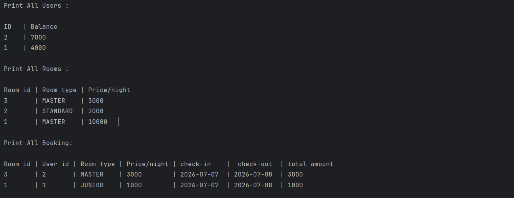

# Hotel Reservation System (Plain Java + JUnit 5 + Lombok)

This repo contains  core functions of a Hotel Reservation System; Create/Update Users, Create/Update Room, Book Room and print booking information.

Everything lives in three folders only:

project-root/

├─ src/ → Production classes (User, Room, Booking, BookingService…)

├─ test/ → JUnit 5 tests

└─ lib/  → Third-party jars (JUnit, Lombok)

No Maven or Gradle is required: you compile and run directly with the JDK.

---

## 1 Prerequisites

| Tool | Version | Notes |
|------|---------|-------|
| **JDK** | 11 + (17 recommended) | `javac` and `java` must be on your PATH |
| **JUnit 5** | 5.10.0 or newer | grab the **console-standalone** JAR (single file) |
| **Lombok** | 1.18.30 or newer | optional—only if you kept Lombok annotations |

### Download the jars

1. **JUnit (all-in-one)**  
   <https://repo1.maven.org/maven2/org/junit/platform/junit-platform-console-standalone/1.10.2/junit-platform-console-standalone-1.10.2.jar>

2. **Lombok** (if used)  
   <https://projectlombok.org/download>

Copy them into the **`lib/`** folder.

---

## 2 Compile everything

```bash
$sources = Get-ChildItem -Path src, test -Filter *.java -Recurse | Select-Object -ExpandProperty FullName 

& javac -cp "lib/*" -d bin $sources
```


## 3 Run Tests

```bash
java -jar lib/junit-platform-console-standalone-1.10.2.jar --classpath bin --scan-class-path
```

---
## 4  Result of Exercise Test


## 5  Design Questions (Bonus)
1/- Suppose we put all the functions inside the same service. Is this the
recommended approach ? 

Putting all functions in a single service is not recommended. It violates the Single Responsibility Principle, 
makes the code harder to read, test, and maintain, and doesn't scale well when new features are added. 
A better design is to split responsibilities into smaller services like UserService, RoomService, and BookingService. 
This improves modularity, testability, and overall code quality.

2/- In this design, we chose to have a function setRoom(...) that should
not impact the previous bookings. What is another way ? What is your
recommendation ? Please explain and justify.

- Store a snapshot of the room data in the Booking entity at the time of booking.
- Add a totalAmount field to the Booking entity to avoid recalculating the amount if the room price changes later.